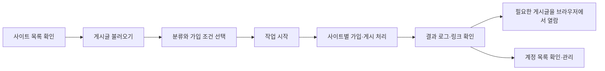

# TTSOFT 커뮤니티 프로그램 분석

- 분석일: 2026-09-16
- 자료: [원본 영상](https://www.youtube.com/watch?v=PQgA-d87kro), [시점별 관찰 기록](ttsoft-video-evidence.md)
- 원본 게시일: 2020-08-21
- 범위: 영상에 나타난 기능·화면·사용 흐름과 그에 대한 설계 평가. 현재 제품 조사, 소스 코드 분석, 프로그램 실행 검증은 포함하지 않는다.

## 1. 프로그램의 목적과 핵심 가치

영상 속 프로그램은 여러 커뮤니티 사이트의 계정과 게시글을 관리하고, 선택한 대상에 가입·글쓰기 작업을 수행한 뒤 결과를 기록하는 데스크톱 도구다. 사이트 목록, 게시글 양식, 실행 설정, 결과 로그를 한곳에 모으는 것이 중심이다.

영상에는 홍보·구인구직·꽁머니 분류가 나오며, 공급자가 직접 밝힌 용도는 커뮤니티 홍보다. 구인구직은 게시 대상 분류다. 근로자 등록, 현장 배치, 출근부, 일당·정산 관리 기능은 관찰한 화면에 나타나지 않는다. 따라서 이 영상만으로 인력사무소 운영 전반을 다루는 프로그램이라고 해석할 근거는 없다. [E02, E06]

사용자에게 주는 효용은 사이트마다 반복하던 준비·입력·결과 확인을 하나의 작업 흐름으로 묶는 데 있다. 제품의 유지보수 관점에서는 화면 자체보다 사이트 변경 대응, 계정 상태 관리, 작업 결과의 정확성이 중요해 보인다. 이 평가는 관찰을 바탕으로 한 분석이다.

## 2. 기능 구성

| 영역 | 영상에서 확인한 기능 | 해석과 검증 한계 | 근거 |
| --- | --- | --- | --- |
| 사이트 목록 | 이름, 주소, 분류, 가입 방식, 계정, 개별 딜레이를 표로 관리 | 공급자가 목록을 갱신한다고 설명한다. 자동 동기화인지 수동 배포인지 미확인 | E02–E03 |
| 대상 선택 | 홍보·구인구직·꽁머니 복수 선택 | 사이트·게시판 대상을 범주로 좁히는 기능으로 보임 | E06 |
| 가입 조건 | 자동가입 가능 사이트만 사용하는 옵션 | 꺼진 상태의 구체적인 처리 방식은 충분히 시연되지 않음 | E07 |
| 게시글 관리 | 번호가 있는 글 선택, 불러오기, 제목 및 본문 표시 | 저장 가능한 개수와 전체 편집·첨부 기능은 미확인 | E04–E05 |
| 서식 표시 | 서식·하이퍼링크가 포함된 본문 미리보기 | 내부 데이터가 HTML인지 특정 편집기 문서인지 미확인 | E05 |
| 실행 제어 | 시작, 중지, 진행 막대 | 중지 시 요청 취소·마무리·복구 동작은 미확인 | E07, E11 |
| 계정 관리 | 사이트별 계정 보관과 여러 계정 입력창 | 계정 순환, 동시 사용, 권한 분리 여부는 미확인 | E12–E13 |
| 시간 설정 | 공통 작업 딜레이와 사이트별 분 단위 딜레이 | 반복 간격인지 요청 간격인지, 둘의 우선순위는 미확인 | E02, E12 |
| 운영 로그 | 시작 시각, 작업 순번, 사이트 구분, 가입 결과, 게시글 링크 | 텍스트 로그는 확인되지만 별도 오류 분류·요약 보고서는 미확인 | E07–E11 |
| 결과 열람 | 외부 브라우저로 일부 게시글 확인 | 로그인 필요 여부가 다르고 비로그인 공개 노출은 별도 확인 필요 | E08–E10 |
| 유지관리 | 목록 갱신, 정렬, 계정 초기화, 딜레이 초기화 버튼 | 버튼 존재와 실제 처리·복구 성공은 별개 | E13 |

## 3. 사용 흐름

영상의 시연 흐름은 다음과 같이 정리할 수 있다. 모든 대상의 완주를 보여준다는 의미는 아니다.

상단 실행 설정은 탭이 바뀌어도 유지되고, 작업 영역은 설정·글 보기/글 작성·로그로 나뉜다. 이 배치는 설정과 결과를 오가는 사용에 유리하다. 반면 상태가 대부분 텍스트 로그에 있어 현재 작업, 성공 건수, 실패 건수, 대기 이유를 한눈에 구별하기 어렵다.

오른쪽 큰 설명문은 시연자가 별도로 입력한 문서다. 게시글을 여는 브라우저 역시 별도 창이다. 둘을 프로그램 내부 패널로 포함해 화면 명세를 만들면 원본 UI를 잘못 해석하게 된다. [E01, E08–E10]

## 4. 내부 구조에 대한 추론

아래는 기능 책임을 설명하기 위한 개념 모델이다. 원본 구현을 확인한 아키텍처나 이번 저장소의 확정 개발 명세가 아니다.

| 개념적 구성요소 | 담당할 것으로 추론하는 책임 | 판단 근거 |
| --- | --- | --- |
| 대상 목록 관리 | 사이트와 분류, 지원 방식, 갱신 정보 관리 | 표의 열과 목록 갱신 버튼 |
| 계정 관리 | 사이트와 연결된 계정의 보관·선택 | 계정 열, 여러 계정 입력창 |
| 게시글 관리 | 선택 가능한 글의 제목·본문·링크 보관 | 글 선택·불러오기와 본문 표시 |
| 실행 상태 관리 | 대상 순서, 진행 상태, 시작·중지 상태 관리 | 순번·시각·진행 막대 |
| 외부 사이트 처리 | 사이트 구조에 맞는 가입·게시 동작과 결과 판독 | 사이트 구분 로그와 게시글 링크 |
| 결과 관리 | 사이트별 결과와 게시글 주소 기록 | 누적 로그, 외부 브라우저 확인 |

관찰 가능한 데이터 관계는 `사이트 → 계정`, `게시글 → 실행 작업`, `실행 작업 → 사이트별 결과` 정도로 요약된다. 같은 사이트에 여러 계정을 입력할 수 있으므로 계정 정보는 사이트 이름과 단순히 일대일로 묶이지 않을 수 있다. 다만 계정 선택 규칙은 영상으로 알 수 없다.

Windows 스타일의 폼과 표가 보이지만 이것만으로 C#·WinForms 등 특정 언어·프레임워크를 식별할 수 없다. 자동 처리 중 브라우저가 항상 보이는 것도 아니므로, 외부 브라우저가 등장한다는 이유로 원본의 자동화 엔진을 특정할 수 없다. 네트워크 요청 방식, 데이터베이스, 서버 구성, 암호화 방식도 미확인이다.

로그에서 그누보드라는 사이트 구분이 직접 보인다. 이것은 해당 시연 대상에 대한 근거다. 전체 사이트가 같은 게시판 엔진을 쓰거나 하나의 공통 처리기로 지원된다는 결론까지 확대할 수 없다. [E08]

## 5. 장점과 개선점

### 장점

1. **작업 대상이 눈에 보인다.** 목록에 대상 주소, 분류, 계정, 가입 방식이 함께 있어 준비 상태를 확인하기 쉽다.
2. **콘텐츠와 실행 설정을 구분한다.** 저장된 글을 불러오고 실행할 글을 선택하는 흐름이 있다.
3. **실행 결과를 추적할 단서가 있다.** 시작 시각과 게시글 링크를 남겨 나중에 결과를 열어볼 수 있다.
4. **자동 처리와 사람의 확인을 함께 사용한다.** 영상에서는 결과를 브라우저로 확인하고 계정도 별도 창에서 관리한다.
5. **대상 목록의 유지관리 기능을 고려했다.** 공급자 갱신 설명과 UI 버튼이 존재한다. 다만 현재 갱신 품질은 별도 검증 대상이다.

### 개선점

| 우선순위 | 관찰 또는 확인 공백 | 사용자에게 생길 수 있는 문제 | 설계 개선 방향 |
| --- | --- | --- | --- |
| 높음 | 비밀번호가 로그와 계정 입력창에 그대로 보임 | 화면 공유·녹화·로그 전달 과정에서 인증정보가 노출됨 | 로그에 비밀번호를 남기지 않고, 입력창은 기본 마스킹. 저장 암호화 여부는 별도 점검 |
| 높음 | 작업 번호, 진행 막대, 실제 성공의 관계가 불분명 | 진행률을 전체 성공률로 오해함 | 전체·처리 중·완료·실패·확인 필요 건수를 구분 |
| 높음 | 게시글 링크 생성과 공개 열람이 구분되지 않음 | 사용자는 게시됐다고 이해하지만 외부에서는 로그인 요구 또는 열람 불가일 수 있음 | 등록 결과, 확인 결과, 공개 범위를 별도 상태로 표시 |
| 높음 | 중지·재실행·복구의 의미가 영상에서 확인되지 않음 | 작업 재시작 때 중복 실행 또는 누락 가능성을 판단하기 어려움 | 중지 시점을 기록하고 재개 대상과 이미 완료된 대상을 구분 |
| 중간 | 계정·설정 초기화 버튼이 일반 작업 버튼과 가까움 | 잘못 클릭했을 때 복구 범위를 알기 어려움 | 영향 범위를 먼저 보여주고, 설정 변경 이력·복원 수단 제공 |
| 중간 | 여러 계정 추가가 우클릭으로 안내됨 | 처음 쓰는 사용자가 기능을 발견하기 어려움 | 선택한 사이트의 명시적인 계정 관리 버튼 제공 |
| 중간 | 공통·개별 딜레이가 함께 있으나 관계 설명이 부족함 | 실제 작업 시각을 예측하기 어려움 | 적용 규칙, 다음 작업 시각, 대기 이유 표시 |
| 중간 | 오류 사례와 오류 요약 화면이 시연되지 않음 | 실패 원인을 찾기 위해 긴 로그를 읽어야 할 가능성 | 구조화된 결과 목록과 원인별 필터, 사람이 확인할 작업 분리 |

위 표에서 영상에 보이지 않은 기능은 **부재가 확정된 결함**으로 취급하지 않았다. 예를 들어 실패 재시도가 보이지 않았다는 이유만으로 원본에 재시도 기능이 없다고 단정할 수 없다.

## 6. 성능·신뢰성 평가의 한계

영상은 일부 가입 성공 로그와 여러 게시글 결과를 보여준다. 이것은 기본 흐름을 시연한 근거다. 다음 항목의 근거로 사용하기에는 부족하다.

- **전수 성공률:** `38 / 206` 등의 표기는 작업 순번과 분모다. 206개 전부 성공했다는 결과표는 없다.
- **현재 지원 수:** 2020년 목록과 공급자의 당시 설명으로 2026년 지원 범위를 판단할 수 없다.
- **장시간 안정성:** 프로그램 재시작, 네트워크 중단, 사이트 개편, 계정 만료 뒤 동작이 확인되지 않는다.
- **반복 안전성:** 같은 작업을 다시 실행할 때 중복을 막는지, 완료 대상을 건너뛰는지 미확인이다.
- **공개 도달:** 게시글 링크가 있어도 로그인 없이 보이는지, 추후 삭제되는지, 실제 조회가 발생하는지는 별도 문제다.
- **보안 저장:** 비밀번호의 화면 노출은 확인되지만 저장 파일의 암호화 여부는 확인하지 않았다.

공급자가 자동가입 가능한 대상으로 분류한 사이트는 모두 가입된다고 설명하는 부분은 성능 주장이다. 영상에 나타난 몇 개의 성공 사례와 구분해야 한다. [E14]

## 7. 이 저장소에 참고할 수 있는 범위

저장소 이름만으로 앞으로 개발할 제품 범위를 확정하지 않는다. 향후 인력사무소 업무 도구를 만든다면 이 영상은 **대상 목록·작성 양식·작업 실행·결과 추적을 연결하는 운영 화면**의 참고 자료로 사용할 수 있다.

사용 권한이 있는 채널의 구인 공고를 관리하는 기능에는 공고 양식, 게시 대상, 게시 상태, 담당자 확인 흐름을 참고할 수 있다. 근로자·거래처·현장·배치·근태·정산은 이 영상과 별도로 요구사항을 수집해야 한다. 영상의 자동가입과 홍보 기능을 그대로 핵심 제품 범위로 채택한 것은 아니다.

개발 방향을 정하기 전에 중요한 선택은 다음 네 가지다.

1. 사무소 내부 운영을 관리할지, 구인 공고의 게시·결과를 관리할지, 두 영역을 모두 다룰지.
2. 실제로 연동할 대상이 무엇이며 어떤 공식 연동 또는 사용 권한이 있는지.
3. 담당자가 승인해야 하는 단계와 자동 처리할 수 있는 단계가 어디인지.
4. 성공을 단순 처리 완료, 실제 게시 확인, 채용 성과 중 어떤 지표로 정의할지.

이 항목은 후속 검토 사항이며 이번 요청에서 구현을 시작하지 않았다.

## 8. 검토와 산출물의 상태

- 유튜브 페이지와 주요 시점 화면을 직접 대조하고, 15개 근거 항목을 별도 기록했다.
- 음성 전사, 원본 소스 코드, 실행 파일, 네트워크 기록은 확보하지 않았다.
- 보조 자동 장면 분석은 결과가 확보되지 않아 분석 근거로 사용하지 않았다.
- 영상 속 인증정보와 홍보 대상 주소 목록을 저장소로 옮기지 않았다.
- 이번 산출물은 문서다. 원본 프로그램의 기능·성능·보안 테스트나 이 저장소의 애플리케이션 테스트를 수행한 결과가 아니다.
- 문서 링크, 근거 ID 참조, 공백 오류와 변경 파일 범위를 검토해 단계별로 커밋·푸시한다.

전체 판단은 **기본 작업 흐름을 시연한 제품으로서 참고 가치는 있으나, 현재 운영 가능한 제품의 완성도나 전수 성공률까지 입증한 영상은 아니다**라는 것이다. 가장 참고할 만한 부분은 대상·글·실행·결과의 연결이며, 가장 먼저 개선할 부분은 인증정보 노출과 결과 상태의 명확성이다.
